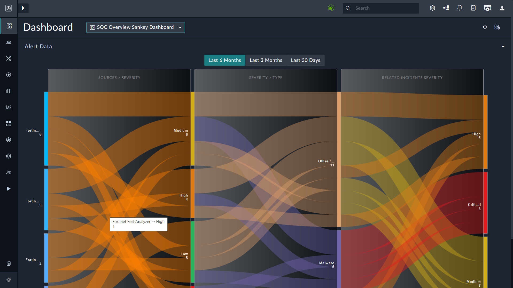

| [Home](../README.md) |
| -------------------- |

# Usage

The **SOC Overview Sankey** widget helps visualize relationship data as per behavior. For example, viewing the data as per status of related incidents of alerts group by source and severity.

You can add this view to a dashboard, or a report.

## Visualize Relationship Data for a Preset Interval

- You can select from following options:

    - 30 Days
    - 3 Months
    - 6 Months

        

- Configure the widget by selecting source node, target node, setting filters to retrieve the required data and can add upto 3 layers.

- The links colors are picked as per picklist items configuration. If the picklist value has no color value random color will be applied.

## SOC Overview Sankey Widget

1. Edit a *Dashboard*, or a *Report* and select **Add Widget** button.

    

2. Select **SOC Overview Sankey** from the list to bring up the **SOC Overview Sankey** widget's customization modal.

    

3. Specify the title of the visualization of relationship data as per module in the **Title** field.

    

4. Select the module, whose data is to be represented as a Sankey chart as per relationship, in the **Resource** field.

    

5. Define the filter criteria using which to filter the data retrieved by this widget (Optional), in the **Filter Criteria** field. To know more about using the filter criteria, refer to the [Nested Filter](https://docs.fortinet.com/document/fortisoar/7.4.3/user-guide/207943/dashboards-templates-and-widgets#Nested-Filters) section of the FortiSOAR&trade; user guide.

    

6. Add label which will be displayed as title to the flow between nodes.

7. Select the field to group data for source nodes, in the **Source Node** field.

    

8. Select the field to group data for target nodes, in the **Target Node** field.

    

9. Select the **Target Picklist** module, to group data to visualize as per relation, in the Target Node field.
    

10. Add Layer to add additional layer of source and target node.

### SOC Overview Sankey Widget - View

The following image displays a **SOC Overview Sankey** widget based on an example where you might want to view the data flow of related alerts group by source, severity, state and type:

1. Click **Last 30 Days** to display data for the last 30 days. This option is a default selection for the initial rendering.

2. Click **Last 3 Months** to display data for the last 3 months.

3. Click **Last 6 Months** to display data for the last 6 months.

<table>
    <th>NOTE</th>
    <td>If for any specific duration selection if there is no data, then the <strong>SOC Overview Sankey</strong> widget displays the following message:  
    <strong><code>No records found!</code></strong></td>
</table>

<table>
    <th>NOTE</th>
    <td>If the data selection is not valid that the nodes and links data will not be formed correctly , then the <strong>SOC Overview Sankey</strong> widget displays the following message:  
    <strong><code>Nodes and Links not created by the given data!</code></strong></td>
</table>

| [Installation](./setup.md#installation) | [Configuration](./setup.md#configuration) |
| --------------------------------------- | ----------------------------------------- |
